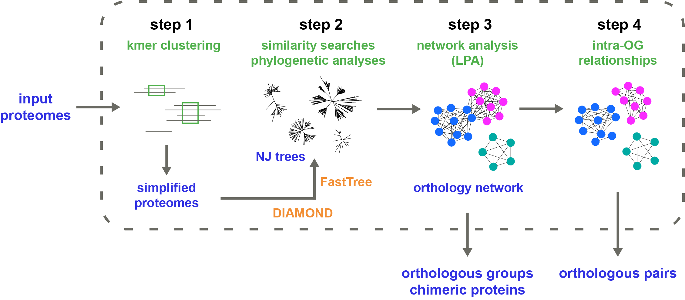

<p align="center">
  
</p>

## Overview

Broccoli, a user-friendly pipeline designed to infer with high precision orthologous groups and pairs of proteins using a phylogeny-based approach. Briefly, Broccoli performs ultra-fast phylogenetic analyses on most proteins and builds a network of orthologous relationships. Orthologous groups are then identified from the network using a parameter-free machine learning algorithm (label propagation). Broccoli is also able to detect chimeric proteins resulting from gene-fusion events and to assign these proteins to the corresponding orthologous groups. 

__Reference:__ <a href="https://doi.org/10.1101/2019.12.13.875831">Broccoli: combining phylogenetic and network analyses for orthology assignment</a>

<p align="center">
  
</p>


## Requirements
To run Broccoli, you need (see the [**manual**](Manual_broccoli_v1.0.pdf) for installation advices):
- a Unix system (MacOS or Linux)
- Python version 3.6 or above
- <a href="https://github.com/etetoolkit/ete">ete3 library</a>
- <a href="https://github.com/bbuchfink/diamond">Diamond</a> version 0.9.30 or above
- <a href="http://www.microbesonline.org/fasttree/">FastTree</a> version 2.1.11 or above (**single-thread version**)


## Running Broccoli
All parameters and options are available using the `-help` argument (see also the [**manual**](Manual_broccoli_v1.0.pdf) for more details):
```
python broccoli.py -help
```
To test Broccoli with the small example dataset present in the directory `example_dataset` (30 sec to 1mn):
```
python broccoli.py -dir example_dataset
```
Broccoli will store the temporary and output files in 4 directories named `dir_step1` to `dir_step4` (one for each step) located in the current directory.
In this test run, Broccoli should identify 226 orthologous groups and 874 orthologous pairs.


## Current version: 1.1
New: alignements are built from CIGAR strings in Diamond outputs (the version requires Diamond v0.9.30+)


## Licence
This program is free software; you can redistribute it and/or modify it under the terms of the GNU General Public License as published by the Free Software Foundation; either version 3 of the License, or (at your option) any later version.

This program is distributed in the hope that it will be useful, but WITHOUT ANY WARRANTY; without even the implied warranty of MERCHANTABILITY or FITNESS FOR A PARTICULAR PURPOSE. See the GNU General Public License for more details.

You should have received a copy of the GNU General Public License along with this program. If not, see http://www.gnu.org/licenses/.

See "LICENSE" for full terms and conditions of usage.
