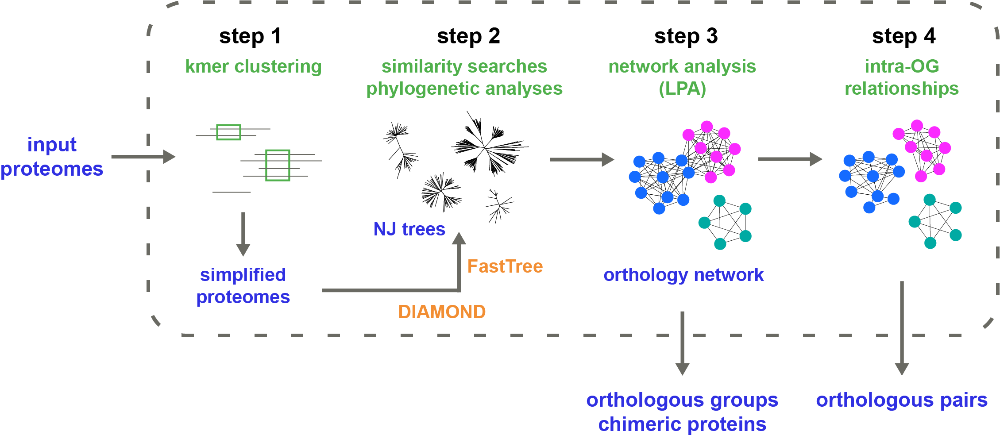

<p align="center">
  
</p>

## Overview

Broccoli is designed to infer with high precision orthologous groups and pairs of proteins using a mixed phylogeny-network approach. Broccoli also detects chimeric proteins resulting from gene-fusion events and assigns these proteins to the corresponding orthologous groups.

<p align="center">
  
</p>

## What's new in v2

Broccoli v2 is a re-implementation of Broccoli v1 (Python) in Rust, written with Claude Opus 5.5. It runs the same four steps with the same parameters and output files, as a single binary, and no longer needs Python or ete3.

Outputs are near-identical to v1: the only differences come from ties, which v1 breaks arbitrarily and v2 deterministically (lowest id or first species); when v1 was modified to break them the same way, both versions gave identical trees, orthologous groups and pairs.

Two new options have 


## Installation

<!-- to be completed -->

```
cargo build --release    # binary: target/release/broccoli
```

You will also need <a href="https://github.com/bbuchfink/diamond">DIAMOND</a> v and <a href="http://www.microbesonline.org/fasttree/">FastTree</a> v2.1.11+.


## Running Broccoli

All parameters and options are available using the `-help` argument (see also the [**manual**](manual_Broccoli_v1.2.pdf) for more details):

```
# display help menu
broccoli -help

# run Broccoli with 8 threads
broccoli -dir my_directory -t 8

# use one combined DIAMOND search and NJ trees at step 2 (fastest)
broccoli -dir my_directory -t 8 -combined_search -phylogenies nj
```

Broccoli will store the temporary and output files in 4 directories named `dir_step1` to `dir_step4` (one for each step) located in the current directory.

## Citation

If you use Broccoli, please cite:
Broccoli: combining phylogenetic and network analyses for orthology assignment.
